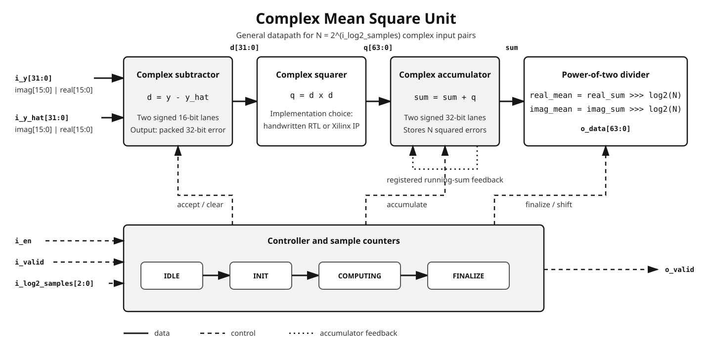

# Complex Mean Square Unit

This project implements a Complex Mean Square (CMS) processing unit in Verilog.
The unit receives two streams of signed complex samples—an observed value `y`
and an estimate `y_hat`—measures their complex squared difference, accumulates
that difference across a configurable number of samples, and returns the mean.

The repository contains the RTL source, automated simulations, a generated
Xilinx Complex Multiplier IP core, and historical synthesis and implementation
reports for an Artix-7 FPGA.

The main goal is to implement the same CMS operation using two design flows and
compare their FPGA resource usage:

1. **Non-IP flow:** the complex multiplier is described directly in Verilog and
   synthesized from ordinary RTL.
2. **IP flow:** the multiplier is replaced by Xilinx Complex Multiplier
   LogiCORE v5.0, including the IP's pipeline and valid interface.

The comparison asks whether using the vendor IP changes the number of registers,
LUTs, occupied slices, and DSP blocks needed for the same high-level operation.

## Module operation and circuit structure

For a group of $N$ input pairs, the unit computes

```math
\operatorname{CMS}(y, \hat{y}) =
\frac{1}{N}\sum_{k=0}^{N-1}\left(y_k - \hat{y}_k\right)^2,
\qquad N = 2^{\mathtt{i\_log2\_samples}}.
```

Let the difference for one sample be
$d_k = d_{r,k} + j d_{i,k}$. Its complex square is

```math
d_k^2 = \left(d_{r,k}^2-d_{i,k}^2\right)
+ j\left(2d_{r,k}d_{i,k}\right).
```

This is a complex square, not the magnitude-squared operation
$\lvert y_k-\hat{y}_k\rvert^2$. The result can therefore have both real and
imaginary components, and the real component is not necessarily positive.

The sample count is restricted to a power of two. This allows the final division
to be implemented as an arithmetic right shift rather than a hardware divider.
The shift truncates fractional remainders; arithmetic overflow wraps because the
design does not implement rounding, saturation, or an overflow flag.



*Figure 1 — General structure shared by the IP and non-IP implementations. The
complex-squarer block is either handwritten RTL or the Xilinx multiplier IP.*

The datapath operates as follows:

1. A pulse on `i_en` starts a calculation and clears the previous accumulated
   result.
2. When `i_valid` is asserted, `i_y` and `i_y_hat` provide one complex sample
   pair.
3. The complex subtractor calculates the error
   $d_k = y_k-\hat{y}_k$.
4. The complex multiplier squares the error.
5. The complex accumulator adds the square to the running sum.
6. After $N$ results have been accumulated, each component is shifted right
   by `i_log2_samples`, which divides the sum by $N$.
7. `o_valid` is asserted for one clock cycle while `o_data` contains the mean.

The controller follows four states:

```math
\mathtt{IDLE}\rightarrow\mathtt{INIT}\rightarrow
\mathtt{COMPUTING}\rightarrow\mathtt{FINALIZE}\rightarrow\mathtt{IDLE}.
```

Separate receive and process counters allow the IP implementation to distinguish
between a sample accepted at the multiplier input and a delayed result produced
at its pipelined output.

## Input and output representation

Each input is a packed 32-bit complex number containing two signed 16-bit
two's-complement components:

```text
 31                              16 15                               0
+---------------------------------+----------------------------------+
|        imaginary (int16)        |          real (int16)            |
+---------------------------------+----------------------------------+
```

The output is a packed 64-bit complex number containing two signed 32-bit
two's-complement components:

```text
 63                              32 31                               0
+---------------------------------+----------------------------------+
|        imaginary (int32)        |          real (int32)            |
+---------------------------------+----------------------------------+
```

For example, `o_data = 64'h0000000D_00000015` represents $21+13j$.

## Interface

| Signal | Direction | Width | Description |
|---|---|---:|---|
| `i_clk` | input | 1 | Rising-edge clock |
| `i_arst` | input | 1 | Active-high asynchronous reset |
| `i_en` | input | 1 | Starts a calculation while the controller is idle |
| `i_log2_samples` | input | 3 | Base-2 logarithm of the sample count |
| `i_valid` | input | 1 | Indicates that both input samples are valid |
| `i_y` | input | 32 | Packed observed complex sample |
| `i_y_hat` | input | 32 | Packed estimated complex sample |
| `o_valid` | output | 1 | One-cycle result-valid pulse |
| `o_data` | output | 64 | Packed complex CMS result |

`i_log2_samples` supports values from 0 through 7, corresponding to 1 through
128 samples. It must remain stable from the `i_en` pulse until `o_valid`. There
is no `ready` output or backpressure mechanism.

## The two implementations

### Non-IP RTL flow

[`rtl/complex_mean_square.v`](rtl/complex_mean_square.v) instantiates the
handwritten combinational multiplier in
[`rtl/complex_multiplier.v`](rtl/complex_multiplier.v). The Verilog source is
portable and does not instantiate vendor primitives directly. When synthesized
for the chosen Artix-7 device, Xilinx ISE inferred six DSP48E1 blocks.

The current non-IP controller treats the combinational multiplier output as
valid on every computing cycle. Input samples must therefore be contiguous:
after the first accepted sample, keep `i_valid` asserted and present one new
pair per clock until all $N$ pairs have been supplied. A gap can cause the
unchanged input to be accumulated again.

### Xilinx IP flow

[`rtl/complex_mean_square_wip.v`](rtl/complex_mean_square_wip.v) instantiates
Xilinx Complex Multiplier LogiCORE v5.0 from
[`ip/complex_multiplier_ip`](ip/complex_multiplier_ip). The multiplier has a
clocked streaming interface and reports output validity independently of input
validity. Its output is reduced from the IP's 80-bit format to the 64-bit format
used by the accumulator.

This flow depends on the generated core and Xilinx simulation libraries. The
`_wip` name is retained because it is not included in the portable Cocotb
regression.

## Observed implementation comparison

Xilinx ISE 14.7 placed and routed both variants for an Artix-7
`xc7a100t-3csg324` device:

| Resource | Device capacity | Non-IP RTL | Xilinx IP | Observation |
|---|---:|---:|---:|---|
| Slice registers | 126,800 | 84 | 86 | Almost unchanged |
| Slice LUTs | 63,400 | 192 | 258 | IP used 66 more LUTs |
| Occupied slices | 15,850 | 59 | 81 | IP occupied 22 more slices |
| DSP48E1 blocks | 240 | 6 | 3 | IP used 3 fewer DSP blocks |
| Bonded I/O | 210 | 136 | 136 | Identical top-level interface |

The likely tradeoff is that the vendor multiplier maps multiplication more
efficiently onto DSP blocks while adding pipeline/interface and surrounding
logic. This is an interpretation of the utilization reports; the repository
does not contain a gate-level study that attributes every additional LUT.

The synthesis report also contains a 381.883 MHz estimate, but the timing report
states that no timing constraints were found. Therefore, the estimate is not a
validated operating frequency and the available reports do not support a fair
performance comparison. See the committed reports:

- [`report/complex_mean_square_summary.html`](report/complex_mean_square_summary.html)
- [`report/complex_mean_square_wip_summary.html`](report/complex_mean_square_wip_summary.html)

## Observed simulation result

The historical ISim run processed eight sample pairs. Their complex squared
differences accumulated to $172+108j$. Dividing both components by eight with
an arithmetic shift produced

```math
\operatorname{CMS} = 21+13j.
```

The testbench printed the result as one packed decimal number:

```text
55834574869 = 64'h0000000D_00000015 = 21 + 13j
```

The simulation completed successfully at 250 ns.

## Running the portable tests

The portable tests use Python, Cocotb, NumPy, and Icarus Verilog by default.
Install Icarus through the system package manager first; on Debian or Ubuntu:

```bash
sudo apt install iverilog
```

Create a Python environment and install the test dependencies:

```bash
python3 -m venv .venv
source .venv/bin/activate
python3 -m pip install -r requirements-dev.txt
```

Run the integration and unit tests from the repository root:

```bash
make test             # complete non-IP CMS datapath
make test-adder       # complex adder/subtractor
make test-multiplier  # handwritten complex multiplier
```

A sufficiently recent Verilator installation can be selected instead:

```bash
make test SIM=verilator
```

Set `WAVE=1` to request waveform generation. Build directories, waveforms, and
JUnit XML results are generated locally and ignored by Git.

## Recreating the Xilinx ISE project

The original tool flow uses Xilinx ISE 14.7:

- Project creation and synthesis: Project Navigator and XST
- Behavioral simulation: ISim, compiled with `fuse`
- Implementation: MAP and PAR
- Static timing analysis: TRACE
- Simulation libraries: `unisims_ver`, `unimacro_ver`, `xilinxcorelib_ver`, and
  `secureip`

With the ISE commands available on `PATH`:

```bash
make setup       # create build/complex_mean_square.xise
make simulate    # compile and run the ISim testbench
make clean       # remove generated ISE and portable-test files
```

The repository does not include pin assignments, a UCF/XDC timing constraint,
or a board definition. The flow can reproduce the project structure, but a board
target and constraints must be added before producing a meaningful deployable
bitstream.

## Repository layout

```text
.
├── docs/       Architecture figure used by this README
├── ip/         Generated Xilinx Complex Multiplier IP and configuration
├── report/     Historical ISE implementation summaries
├── rtl/        Verilog datapath and top-level modules
├── scripts/    ISE project-generation and simulation scripts
└── sim/
    ├── rtl/        ISim testbenches and result checker
    └── verilator/  Portable Cocotb tests, also usable with Icarus
```

## Project status and limitations

The RTL operation, non-IP Cocotb regression, and historical placement and routing
results are available. The repository is suitable as an implementation and
resource-comparison project, but it is not a complete board-ready deliverable.

- The non-IP flow requires a continuous valid stream.
- Fixed-width arithmetic wraps on overflow and does not report saturation.
- Power-of-two division truncates rather than rounds.
- The streaming interface does not provide backpressure.
- The IP flow is not covered by the portable automated test suite.
- No board constraints, bitstream, or physical-hardware measurements are
  included.
- No constrained timing comparison between the two flows is available.
